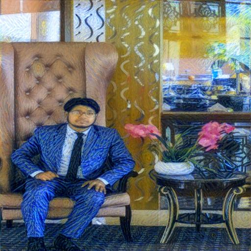
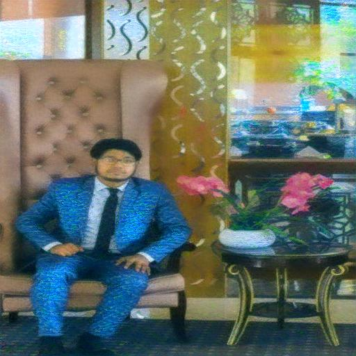
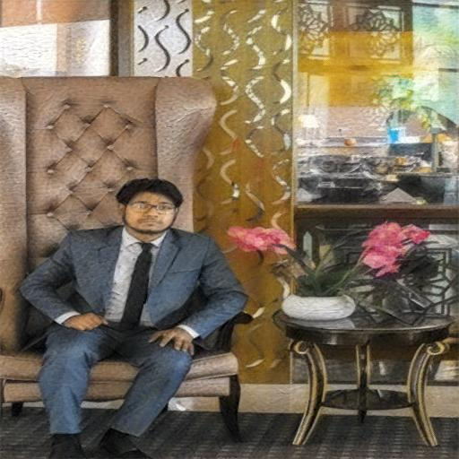
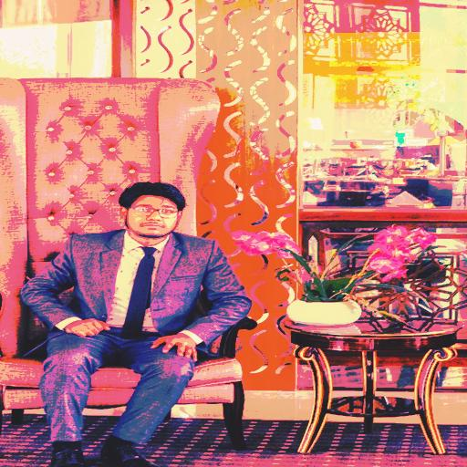
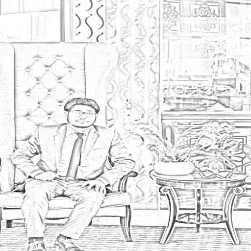

# 🎨 Art Style Transfer

> Applying famous art styles to personal photos using Neural Networks (VGG19) and Classical Image Processing methods.

---

## 📌 Overview

This project implements **Neural Style Transfer** using a pre-trained VGG19 convolutional neural network, alongside **Classical Style Transfer** methods for comparison. A full **Tkinter desktop app** is included for interactive use.

The project was built as part of the **Image Recognition Systems** university course.

---

## 🖼️ Results

### Neural Style Transfer (VGG19)

| Content | Van Gogh | Monet | Picasso | Warhol |
|---------|----------|-------|---------|--------|
|  |  |  |  |  |

### Classical Methods

| Content | Reinhard | Histogram | Sketch |
|---------|----------|-----------|--------|
|  |  |  |  |

---

## 🧠 How It Works

### Neural Method (VGG19)